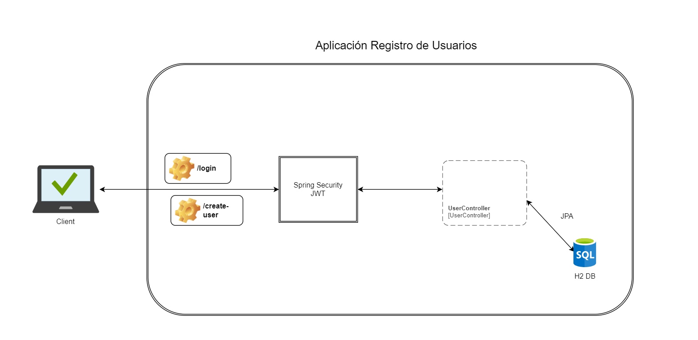

### Diseño

## # Como correr programa ? 

1. Ejecutar programa (puerto de ejecucion 8070).
2. Para crear usuarios usar el siguiente endpoint
    - http://localhost:8070/auth/create-user

3. Para iniciar sesion usar el siguiente endpoint
   - http://localhost:8070/auth/login
   - El usuario para hacer pruebas es 
   - {"username":"test@test.com", "password": "password"}

4. Ingreso a memoria H2
   - http://localhost:8080/h2-console/
   - usuario (sa), no contraseña 

